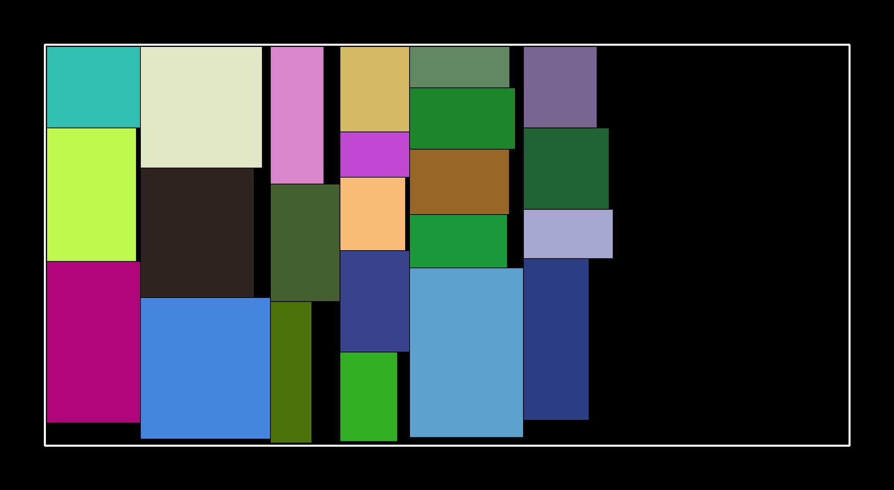

# layout-genetic-algorithm
Rectangular layout based on genetic algorithm. Below is the visualization result：

## Prerequisites

* [OpenCV](https://opencv.org/)

In this project, opencv is only used for result visualization and it is integrated into the project so you don't need to configure it anymore. If you have any other questions, feel free to contact me:

* **Email**: [callmenone@elude.in](http://elude.in/) 

## Operating Environment

The following environment has been tested:

| OS               |  IDE   | x64/Debug | x64/Release |
| :--------------- | :----: | :-------: | ----------: |
| Windows10, 64bit | VS2017 |    Yes    |         Yes |

# License

This project is licensed under the Apache 2.0 License - see the [LICENSE.md](https://github.com/doycode/layout-genetic-algorithm/blob/master/LICENSE ) file for details. 
